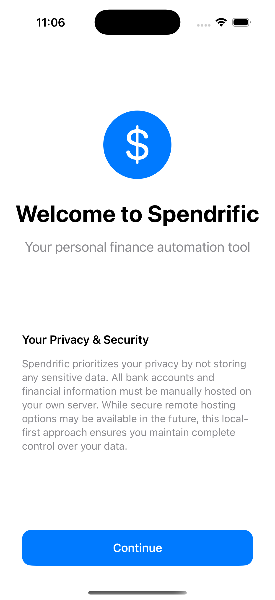
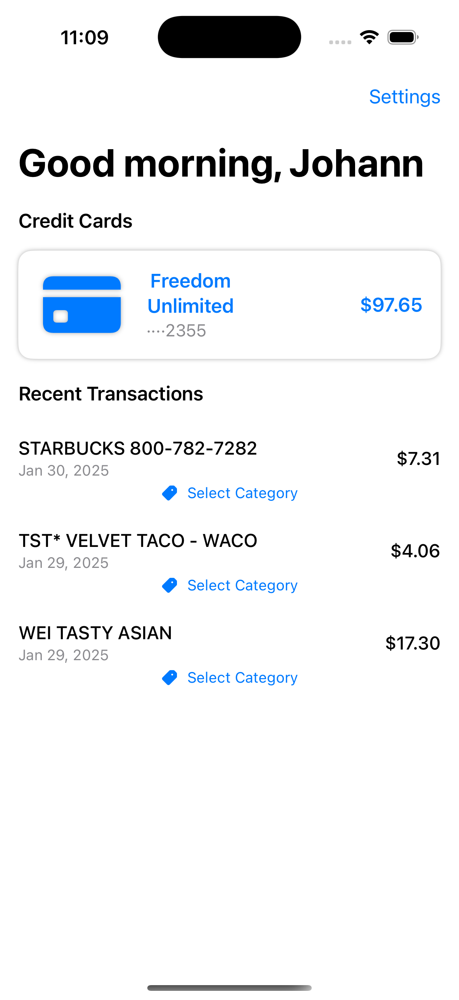
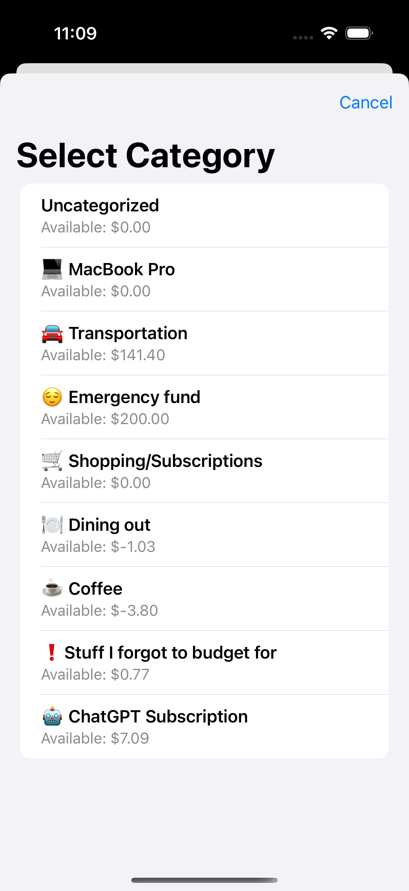
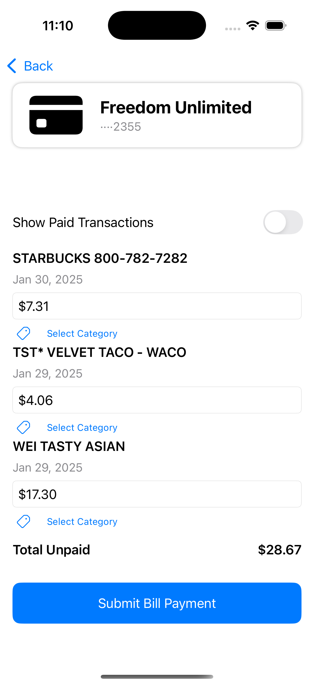
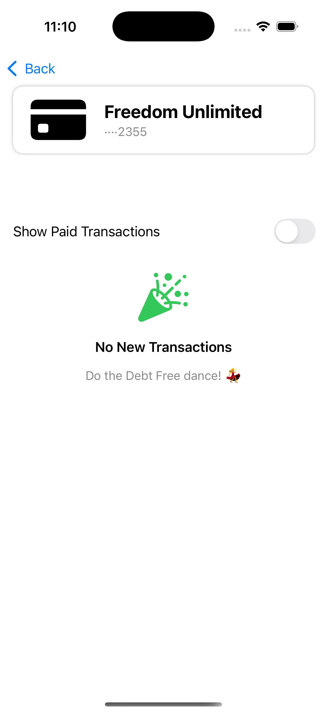

# Spendrific 💳

Turn your credit card into a debit card while keeping all the benefits! Spendrific automatically initiates bill payments at point-of-sale, bringing mindful spending to credit card transactions.

## 🌟 Features

- **Real-time Bill Pay**: Automatically initiates bill payments from your checking account when you use your credit card
- **Transaction Management**: View and manage all transactions (paid/unpaid) through a sleek iOS interface
- **Amount Adjustments**: Modify transaction amounts (e.g., adding tips) before payment
- **Automated Background Processing**: Continuous monitoring of new transactions
- **Budgeting Integration**: Seamlessly incorporates with popular budgeting tools (YNAB, EveryDollar, Mint)

## 🎯 Problem Solving

Spendrific addresses two critical issues in personal finance:

1. **Mindful Spending**: Reintroduces friction into credit card transactions at point-of-sale
2. **Financial Health**: Promotes better spending habits while maintaining credit card benefits

## 🛠 Technology Stack

- **iOS App**: Swift & SwiftUI
- **Backend Automation**: Python with Selenium
- **Shell Scripting**: zsh/bash
- **Architecture**: Dual Selenium backend system
  - Background processor for transaction monitoring
  - On-demand processor for bill payment initiation

## 🚀 How It Works

1. **Setup**: Configure your accounts through the native iOS onboarding process
2. **Transaction Monitoring**: Background system continuously checks for new transactions
3. **Bill Pay**: Automatic or manual initiation of bill payments for non-pre-auth charges
4. **Transaction Management**: View, adjust, and manage all transactions through the iOS app

## 📱 App Screenshots

Here's a visual tour of Spendrific's key features:

### Home Dashboard

The home screen provides a quick overview of your recent transactions and account status, with easy access to all key features.

### Transaction Management

View all your transactions in one place, with clear indicators for payment status and transaction details.

### Transaction Details

Dive deep into individual transactions, adjust amounts (for tips), and manage payment status with ease.

### Settings & Preferences

Customize your Spendrific experience and manage notification preferences through an intuitive settings interface.

### Account Setup

Simple and secure account configuration process to link your credit card and checking account.

## 💡 Benefits

- Keep credit card rewards and benefits
- Enhanced purchase protection
- Automatic payment handling
- Real-time checking account balance updates
- Improved spending awareness
- Integration with popular budgeting tools

## 🔒 Security

- Secure account configuration
- Native iOS security features
- Protected automated processes

## 🌈 Why Spendrific?

Spendrific brings the psychological benefits of cash/debit spending to credit card usage. Studies show people spend less when using cash or debit cards - now you can have that same mindful spending experience while keeping all your credit card perks!

## 🔄 Workflow

1. Use your linked credit card
2. Spendrific detects the transaction
3. Bill pay is automatically initiated
4. Your checking account balance updates immediately
5. Track and manage all transactions in the iOS app

## 🎉 Getting Started

[Coming Soon]

## 📝 License

[License Information Coming Soon]

## 🤝 Contributing

[Contribution Guidelines Coming Soon]

## 📞 Support

[Support Information Coming Soon] 